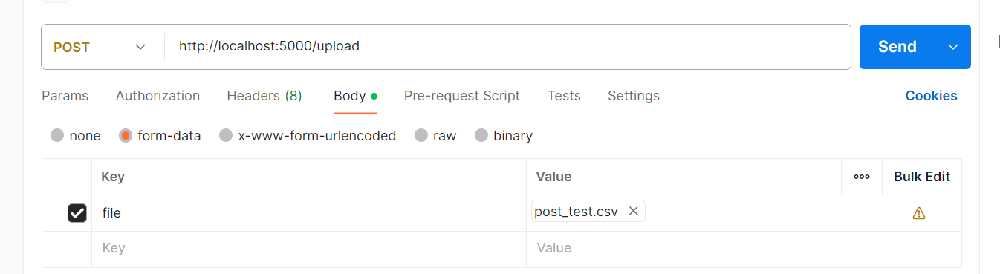

# api

## flask

### 第一个应用

```python
from flask import Flask

app = Flask(__name__) # Flask 应用实例

@app.route('/') # 装饰器
def hello_world():
    return 'Hello, World!'

if __name__ == '__main__':
    app.run(debug=True)
```

### 基本概念--请求对象

请求对象包含了客户端发送的请求信息，包括请求方法、URL、请求头、表单数据等。Flask 提供了 request 对象来访问这些信息。


以post一个csv为例：



```python
@app.route('/upload', methods=['POST'])
def upload_file():
    # 检查请求中是否有文件
    if 'file' not in request.files:
        return jsonify({"error": "No file part in the request"}), 400

    file = request.files['file']

    # 如果用户没有选择文件，浏览器可能会提交空文件名
    if file.filename == '':
        return jsonify({"error": "No selected file"}), 400

    # 验证文件扩展名
    if not allowed_file(file.filename):
        return jsonify({"error": "Only CSV files are allowed"}), 400

    try:
        file = request.files['file']
        filename = file.filename
        temp_path = f"uploads/{filename}"
        file.save(temp_path)  # 保存到临时路径
        df = pd.read_csv(temp_path)  # 读取文件
        columns = df.columns.tolist()
        return jsonify({
            "columns": columns,
        }), 200

    except Exception as e:
        return jsonify({"error": str(e)}), 500
if __name__ == '__main__':
# 确保上传目录存在
os.makedirs(app.config['UPLOAD_FOLDER'], exist_ok=True)
app.run(debug=True)
```

第十八行的file不能直接使用（不能直接用pandas）需要根据filename保存下来然后在用pandas读取

file.filename直接读取文件名

**注意：这是因为 `df.columns` 返回的是一个 **Pandas 的 `Index` 对象**，而 Python 的 JSON 模块（以及 Flask 的 `jsonify`）**无法直接序列化非原生数据类型**（如 `Index`、`DataFrame`、`Series` 等**

**注意区别file和files**

### 直接返回处理后的文件vs分步


#### 直接返回

```python
@app.route('/upload', methods=['POST'])
def upload_file():
    # 检查请求中是否有文件
    if 'file' not in request.files:
        return jsonify({"error": "No file part in the request"}), 400

    file = request.files['file']

    # 如果用户没有选择文件，浏览器可能会提交空文件名
    if file.filename == '':
        return jsonify({"error": "No selected file"}), 400

    # 验证文件扩展名
    if not allowed_file(file.filename):
        return jsonify({"error": "Only CSV files are allowed"}), 400

    try:
        file = request.files['file']
        filename = file.filename
        temp_path = f"uploads/{filename}"
        file.save(temp_path)  # 保存到临时路径
        df = pd.read_csv(temp_path)  # 读取文件
        # 生成处理后的文件
        processed_df = df
        output_filename = f"processed_{filename}"
        output_path = os.path.join(app.config['UPLOAD_FOLDER'], output_filename)
        processed_df.to_csv(output_path, index=False)

        # 返回处理后的 CSV 文件
        return send_file(
            output_path,
            as_attachment=True,
            download_name=output_filename,
            mimetype='text/csv'
        )
        # return jsonify({
        #     "message": "successful",
        # }), 200

    except Exception as e:
        return jsonify({"error": str(e)}), 500
```

#### 分步

##### post api

```python
from flask import Flask, request, jsonify, send_file
import pandas as pd
import os
import uuid
from werkzeug.utils import secure_filename

app = Flask(__name__)

# 配置上传目录
UPLOAD_FOLDER = 'uploads'
PROCESSED_FOLDER = 'processed'
app.config['UPLOAD_FOLDER'] = UPLOAD_FOLDER
app.config['PROCESSED_FOLDER'] = PROCESSED_FOLDER
os.makedirs(UPLOAD_FOLDER, exist_ok=True)
os.makedirs(PROCESSED_FOLDER, exist_ok=True)

# 存储 task_id 和文件路径的映射
task_map = {}

def allowed_file(filename):
    return '.' in filename and filename.rsplit('.', 1)[1].lower() in {'csv'}

@app.route('/upload', methods=['POST'])
def upload_file():
    if 'file' not in request.files:
        return jsonify({"error": "No file part in the request"}), 400

    file = request.files['file']
    if file.filename == '':
        return jsonify({"error": "No selected file"}), 400

    if not allowed_file(file.filename):
        return jsonify({"error": "Only CSV files are allowed"}), 400

    try:
        # 生成唯一任务 ID
        task_id = str(uuid.uuid4())
        original_filename = secure_filename(file.filename)
        upload_path = os.path.join(app.config['UPLOAD_FOLDER'], original_filename)
        file.save(upload_path)

        # 读取并处理数据
        df = pd.read_csv(upload_path)
        processed_df = df

        # 保存处理后的文件
        processed_filename = f"processed_{original_filename}"
        processed_path = os.path.join(app.config['PROCESSED_FOLDER'], processed_filename)
        processed_df.to_csv(processed_path, index=False)

        # 存储 task_id 和文件路径的映射
        task_map[task_id] = processed_path

        return jsonify({
            "task_id": task_id,
            "message": "File uploaded and processed successfully"
        }), 200

    except Exception as e:
        return jsonify({"error": str(e)}), 500
```


##### get api

```python
@app.route('/download/<task_id>', methods=['GET'])
def download_file(task_id):
    file_path = task_map.get(task_id)
    if not file_path:
        return jsonify({"error": "Task not found"}), 404

    if not os.path.exists(file_path):
        return jsonify({"error": "Processed file not found"}), 404

    try:
        return send_file(
            file_path,
            as_attachment=True,
            download_name=os.path.basename(file_path),
            mimetype='text/csv'
        )
    except Exception as e:
        return jsonify({"error": str(e)}), 500

if __name__ == '__main__':
    app.run(debug=True)
```

**上述代码中@app.route('/download/<task_id>', methods=['GET'])的<task_id>的task_id作为函数download_file的参数**


## app启动方法

```python
app.run(debug=True) # 直接使用flask启动，debug参数不用管，会使用默认ip和端口
waitress.run(app) # 使用waitress启动，会使用默认ip和端口
waitress.run(app, host='172.22.132.3', port=8080) # 使用waitress启动，指定ip和端口
```

## postman

### 1. Params

*   **中文**： 参数
*   **是什么**： 这里用来设置 URL 的**查询字符串**。
*   **怎么用**： 当你看到一些网址后面有 `?name=abc&age=20` 这样的内容时，`?` 后面的部分就是查询参数。你在这里填写的 `Key` 和 `Value`，Postman 会自动帮你拼接到 URL 的后面。
*   **前端联系**： 就像你在用 `fetch` 或 `axios` 请求 API 时，有时需要把参数拼在 URL 上。

### 2. Authorization
*   **中文**： 授权
*   **是什么**： 很多 API 不是谁都能访问的，需要证明你有权限。这里就是用来设置身份验证信息的地方。
*   **常见类型**：
    *   **Bearer Token**： 最常见的一种，通常是一串复杂的字符串。你拿到后端给的 Token 后填在这里。
    *   **Basic Auth**： 输入用户名和密码。
    *   **API Key**： 把密钥放在请求头或参数里。

### 3. Headers
*   **中文**： 请求头
*   **是什么**： 你可以理解为发送请求时的“元数据”或“附加信息”。它描述了这次请求的一些基本情况，本身不包含你的主要数据。
*   **常见例子**：
    *   `Content-Type`： **极其重要**！告诉服务器你发送的**body**是什么格式的数据（比如 `application/json`）。
    *   `User-Agent`： 告诉服务器是什么浏览器或设备在发送请求。
    *   `Authorization`： 授权信息有时也会放在这里。

### 4. Body
*   **中文**： 请求体
*   **是什么**： 这是你**发送数据给服务器**时主要存放数据的地方。比如你要创建一篇新文章（`POST`请求），文章标题、内容等信息就放在这里。
*   **`GET` 请求没有 Body**，只有 `POST`, `PUT`, `PATCH` 等请求才有。

**Body 的几种类型 (你图片中表格上面的选项)：**

*   **none**: 不发送任何 Body 数据。
*   **form-data**: 主要用于**提交表单**或**上传文件**。格式类似于 `。
*   **x-www-form-urlencoded**: 也是提交表单，但数据格式和 URL 后面的参数格式一样（`key1=value1&key2=value2`）。不能传文件。
*   **raw**： **最常用**！可以自由地发送任何文本格式，最常用的就是 **JSON**。当前端需要给后端发送一个结构化的数据（比如一个对象）时，基本都用这个格式，并选择 JSON。
*   **binary**： 用于上传单个文件，比如图片、PDF等。

### 5. Pre-request Script
*   **中文**： 请求前脚本
*   **是什么**： 在请求**发送之前**自动执行的一段 JavaScript 代码。
*   **有什么用**： 比如你可以在这里计算一个签名、生成一个随机数、或者从环境变量中获取一个 Token 并设置到请求头里。

### 6. Tests
*   **中文**： 测试脚本
*   **是什么**： 在收到服务器的**响应之后**自动执行的一段 JavaScript 代码。
*   **有什么用**： 这是 Postman 非常强大的功能！用于**自动化测试**。比如你可以写代码检查：
    *   状态码是不是 `200`？
    *   响应体里是否包含某个关键字？
    *   JSON 响应中的某个字段值是否正确？
    *    Tests 通过了，说明接口目前是正常的；失败了，就说明接口有问题。

### 7. Settings & Cookies
*   **Settings**： 这个请求的一些特殊设置，通常保持默认即可。
*   **Cookies**： 管理和查看与这个域名相关的 Cookies。网站常用 Cookies 来记录用户登录状态等信息。
